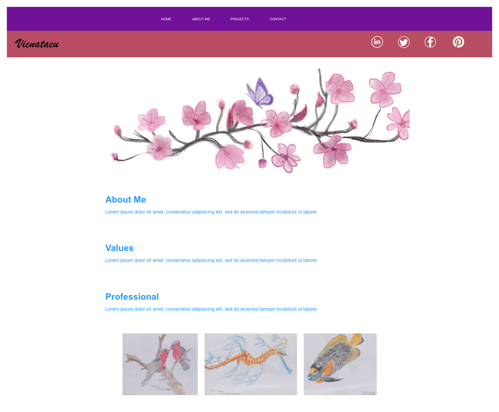
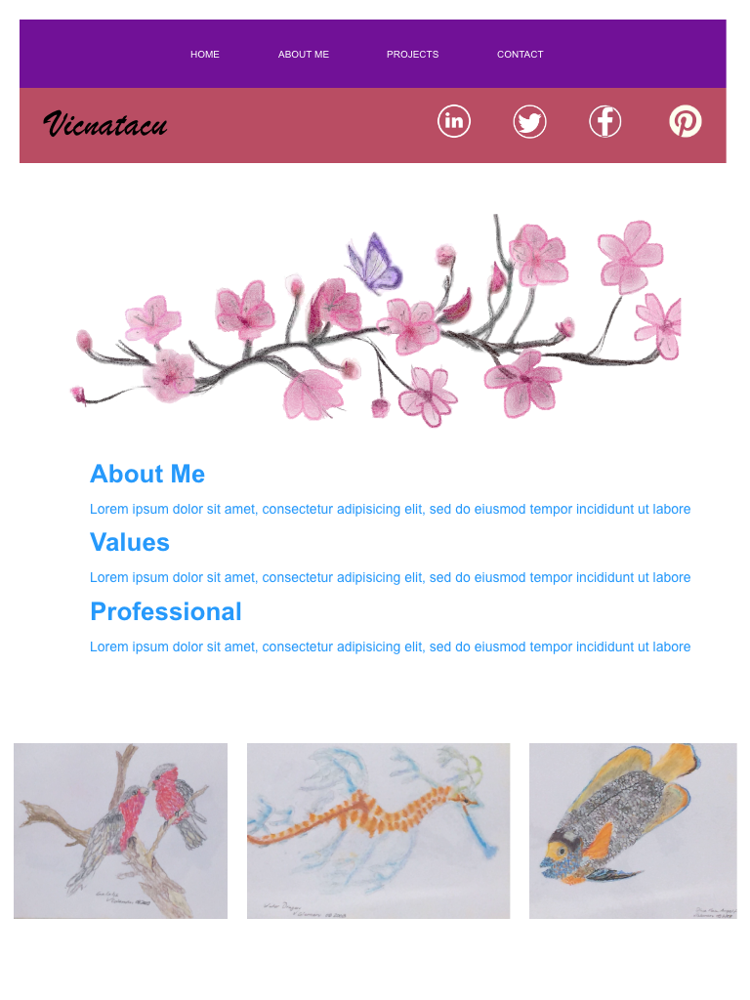
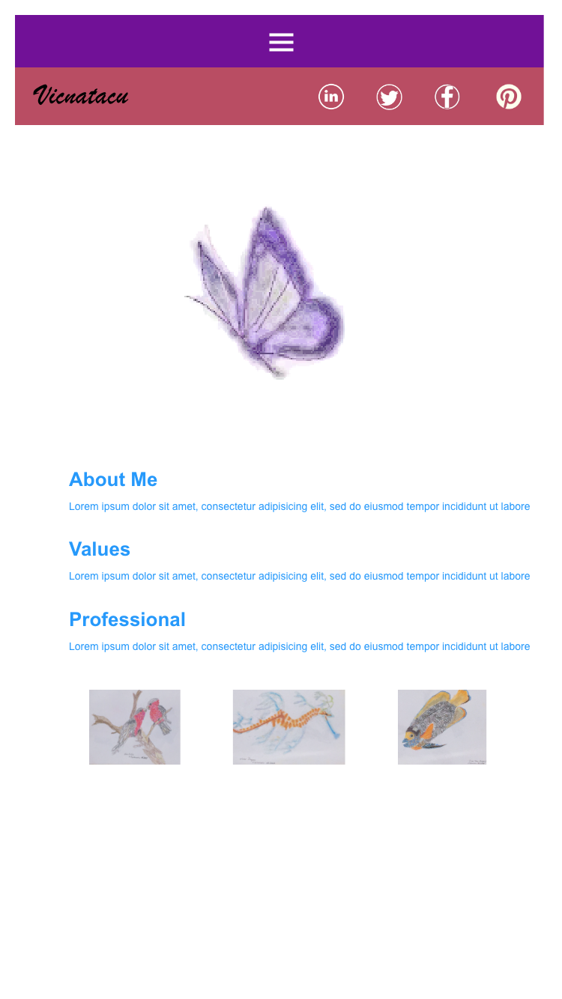
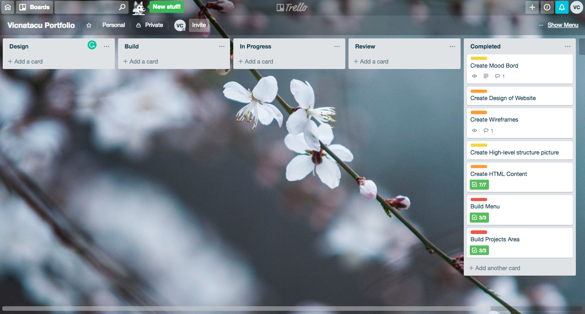

# Portfolio Assignment

- A link (URL) to your published portfolio website
  - https://vicnatacu.github.io/Portfolio/
- A link to your GitHub repository
  - Ensure the repository (repo) is accessible by your Educators
  - https://github.com/vicnatacu
- Description of your portfolio website, including,
  - Purpose
    - To showcase my artistic side, and my values
  - Functionality / features
    - The site has links to more detailed pages (backed by previously developed websites)
  - Sitemap
    - Home
      - About Me
      - Projects
      - Contact
      - Social Links
        - LinkedIn
        - Twitter
        - Facebook
        - Pinterest
      - External Websites
        - Galahs - Raelee.Design
        - Water Dragon - Downunder Girl
        - Fish - Kate Miller-Heigke Tribute site
  - Screenshots
    - 
    - 
    - 
  - Target audience
    - Future Employers, Social Network contacts, Family & Friends
  - Tech stack (e.g. html, css, deployment platform, etc)
    - HTML5/CSS3/JS deployed via a git repository hosted by Github and rendered by GitHub pages.
  - Testing
    - 
- Design documentation including,
  - Design process
    - When developing my [mood board](https://moodzer.com/boards/aZorRKjv/edit) I thought about things I like, such as my favourite animal and bird, Giraffe and Pelican.  I like them for their features that show their uniqueness. What brings me balance in life, time in nature, doing meditation and yoga.  Also time spent with family friends.  Creating trusted, meaningful and valued relationships built on integrity.  How do I create this in a webpage.  But this seemed a bit much!
    - So then I thought about how I admire the inner calmness of Japanese people appear to embody.  This lead me to think about my drawing I did on my iPad of Sakura or Cherry Blossoms.  They embody these qualities in my mind. So that was my answer.
    - When coming up with my design,  I wanted to create a different look and feel to each screen size while still using my drawing.  
    - When it came time to think more about my project area of the website, I returned to my drawings and so included some from days gone by.
    - Challenges I came across
      - How do I create this within my SCSS?  Could I achieve this?
      - Also in my design was a hamburger menu for mobile and a top nav for desktop and iPad.
      - How to create hamburger nav. Research needed w3schools.
      - How to create icons in footer for contacts, trouble with Transparency. I used GIMP to create icons per my website header colour.
      - How to create read more/less. Reasearch w3schools. Not in original spec, but thought about it during development.
  - Wireframes
    - Desktop
    
    - Tablet (portrait)
    
    - Mobile
    
  - Personal logo (optional)
    - I designed my Personal logo to be used a favicon.
    
  - Usability considerations
    - I chose to use full names for menu options on the Desktop and Tablet versions, and a hamburger menu for mobile use.
    - I also used semantic HTML elements to allow for use by a screen reader.
- Details of planning process including,
  - Project plan & timeline
    - I used Trello for my project plan, the link and screenshots of progress are below
  - Screenshots of Trello board(s)
    - https://trello.com/b/Ws2VyjHm/vicnatacu-portfolio
    
    
    
- Short Answer Q&A - Include short answers to the following questions,
  - Describe key events in the development of the internet from the 1980s to today (max. 150 words)
    - Internet history commences in 1950 with development of computers.  The initial concept of wide area networking was created with several computer science laboratories from United States, United Kingdom, and Frances.
    - In 1960's to early 1970's  US Department of Defense awarded contracts. Packet switching networks networks; NPL network, ARPANET, Merit Networks, CYCLADES, and Telenet. Internet Protocol suite (TCP/IP) was developed by Robert Kahn and Vint Cerf in 1970's.
    - In 1968 NSF funded NSFNET project. Part of the project created network access to supercomputer sites in research and education organizations. In 1980's Tim Berners-Lee developed the World Wide Web.  This linked hypertext documents into information systems, being accessible for any node on the network.
    - The late 1980's saw the development  of Internet Service Providers (ISP's). ARPANET was decommissioned in 1990, NSFNET was decommisioned in 1995.
  - Define and describes the relationship between fundamental aspects of the internet such as: domains, web servers, DNS, and web browsers (max. 150 words)
    - Website names can be purchased for a period of time through a Registrar, usually renewable yearly or a perscribed period.
    - Website Hosting Service stores a website's content and files for an agreed yearly value.
    - DNS allows you to type a website name to the a browser and it get converted to an IP. The DNS  keeps records of all the website names and the associated IP address. The easy way to think of it is you  are asking a browser to call Nancy and it does using her number. The DNS server is the glue it has the all information so that when you request a website, the right website is loaded.
  - Reflect on one aspect of the development of internet technologies and how it has contributed to the world today (max. 150 words)
    - The World Wide Web as we now know it has been revoluntionary to the worlds population. When I reflect about what changes the internet has lead to, I think about how it has made the world smaller.
    - It has lead to sharing information and technology around the world.  We have seen huge changes in science, technology, communications and the birth of social networking.

  - Powerpoint Presentation
    [Vicki Coleman Portfolio](docs/Vicki_Coleman_Portfolio.pdf)
  - Please Note
    - You can find further screen shots of my Portfolio site through development.
    - There are screen shots of the Testing spreadsheet at different stages.  Also photos of testing the website on an iPad, iPhone 6+, Alcatel A3 (Android phone), and Safari. I also tested using Screen Reader on my laptop.